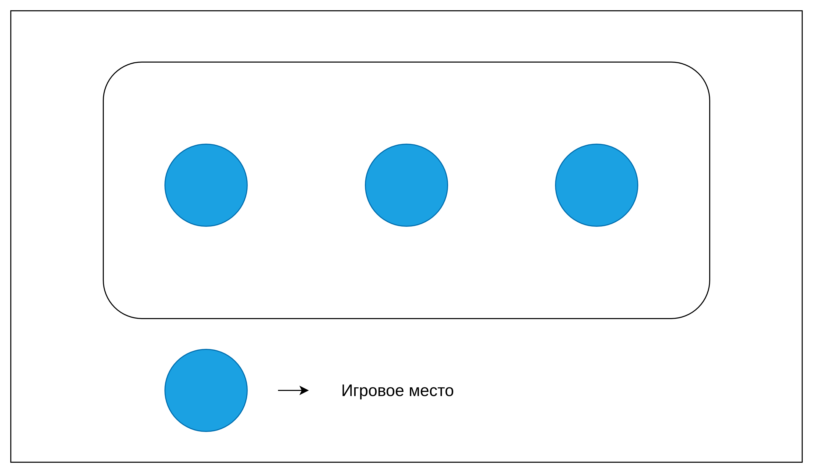
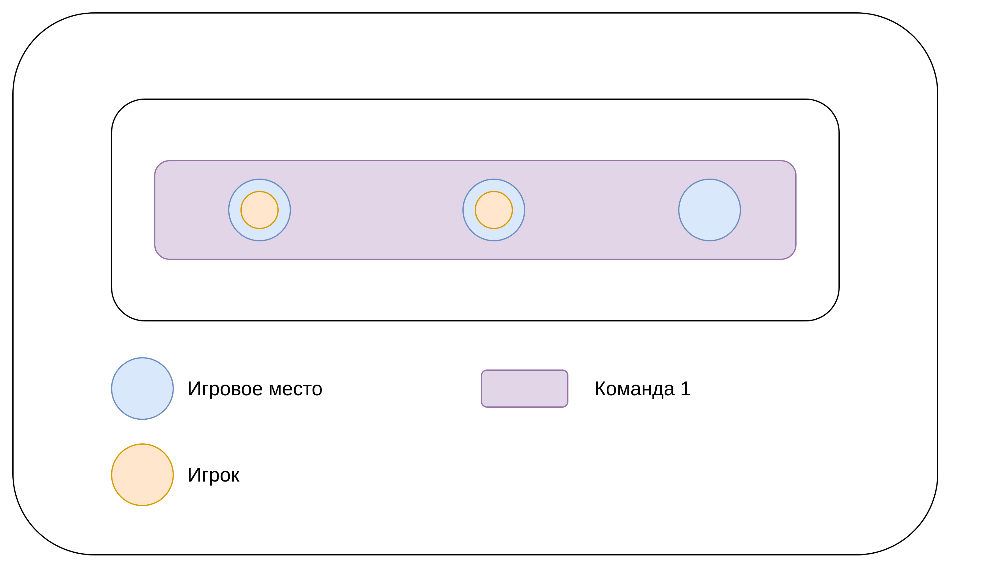
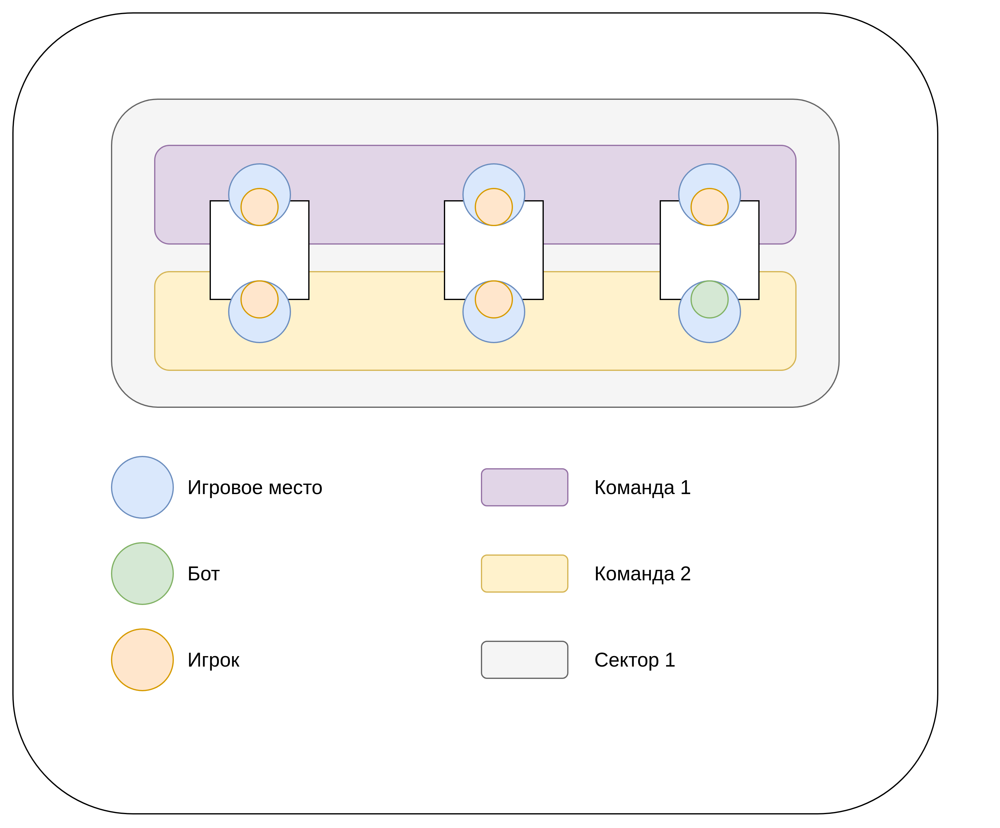
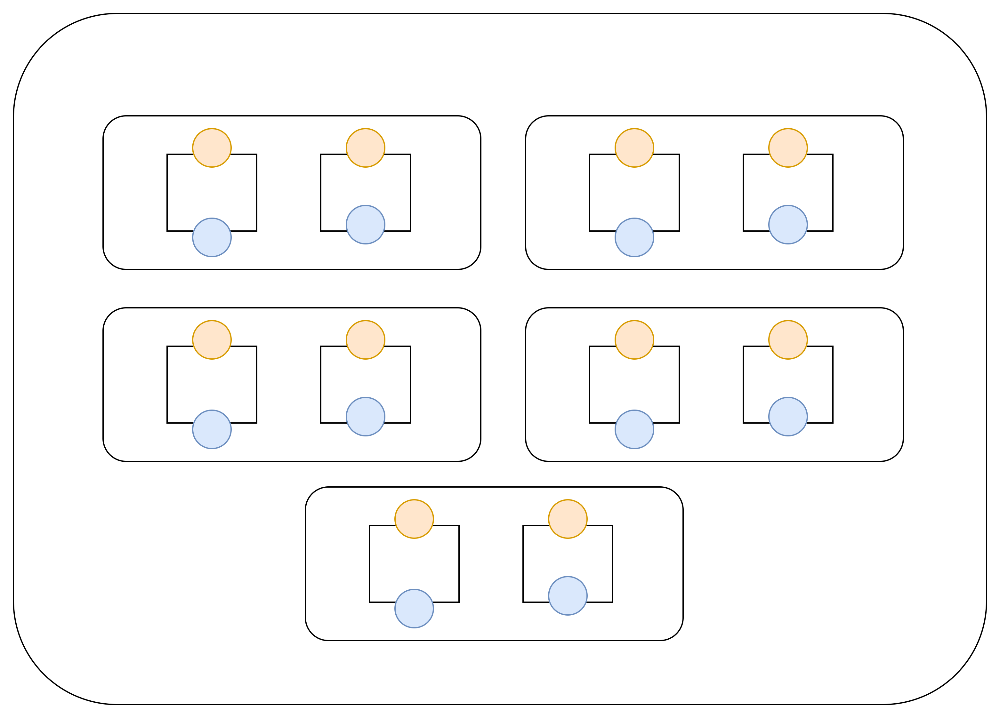

## Основные требования бизнеса
### Основные сущности, которыми управляет игрок

### Player
_Player_ - самая ключевая сущность в системе. Что ясно по названию, Player будет являться игроком, которым управляет пользователь (или бот, для создания иллюзии, что есть онлайн, пока на будущее).

**_Базовые атрибуты игрока:_**
- Фамилия
- Имя
- Отчество
- Дата рождения
- Дата регистрации
- Дата закрытия
- Статус игрока (+ почта)
- Юзернейм
- Почта
- Хэш пароля

**_Что может делать игрок_**, по фичам (общая информация):

- Лобби. Место, где люди собираются и играют друг с другом
    
    Можно выбрать тип игры:

    - _ММ_ (match-making, официальные режимы, которые поддерживают рейтинг, подробнее - далее):
        - Сыграть в MM 

    - _Кастомная игра_ (для поиграть друг с другом, игра будет поддерживать как официальные режимы, так и кастомные (о них - далее), но они не будут точно являться рейтинговыми):
      - Создать свою игру, а также управлять ей

    _Примечание про ММ и кастомную игру_. Это типы, которые может применить игрок-владелец.
    Типы схожи по своему смыслу, и там, и там собираются люди, но вот возможности разные. Для них необходима прямая и обратная совместимости, то есть, игрок-владелец мог находится сначала в одном месте, а потом может перейти к другому, без потери участников. Аналогично в обратную сторону.
    
    Подробнее про совместимость и эти типы будет ниже.

- _Команды_:
  - Создать команду
  - Вступить в команду, т.е принять приглашение на вступление в команду

- _Организация_:
  - Создать организацию, а также управлять ей

- _Турниры_:
  - Присоединится к турниру
  - Создать свой турнир
    
- _Друзья_:
  - Добавить в друзья другого пользователя (отправить заявку)
    
    Механизм подачи заявки в друзья:
    Пользователь в общем поиске игроков вводит никнейм (или имя/фамилию), находит игрока, и может подать завку в друзья. Заявка может быть как отклонена, так и принята. Во втором случае игроки становятся друзьми, и могут быстро получать доступ друг к другу (например, когда нужно пригласить кого то к себе в ММ/кастомную игру)
    
    Статусы заявки:
    1. Appending
    2. Accepted
    3. Rejected

- Удалить из друзей другого пользователя
- Добавить в черный список пользователя
  
  Под черным списком понимается то, что тот пользователь, который находится в черном списке, не может отправлять приглашения куда-либо тому пользователю, кто добавил данного в черный список.

**Попробуем описать суть каждой из упомянутой фичи:**

### Lobby
Лобби - это место, где собираются люди, чтобы поиграть в шахматы.
Представляют собой набор настроек, которые будут применены позже для запуска игры.

**Одновременно плеер может находиться только в одном лобби!**
_Турнир это отдельная история, турнир не является лобби, плеер может принимать участие в турнире и находится в лобби_

Список статусов лобби:
- IDLE - стоит на месте (или же настраивается)
- IN_GAME - в игре
- CLOSED (? нужно ли)

Задача: нужно, чтобы пользователь всегда состоял в каком-нибудь лобби, и было видно, что есть какие то настроки лобби (или чужие, или свои, зависит от того, где находится)

**Жизненный цикл лобби:**
1. Лобби создается со статусом IDLE (Собственное лобби создается как только пользователь вышел из другого лобби, или же как только зарегистрировался)
2. Лобби всячески настраивается пользователем (включая **типы игры**, режимы и т.д)
3. Пользователь запускает игру, статус лобби становится IN_GAME
4. Пользователь присоединяется к лобби другого игрока
    
    Варианты:
    1. Лобби закрывается сразу же (так как в нем никого нету)
    2. Лобби продолжает жить, но там никого нету, и пользователь как только покинет чужое, вернется сразу в это, свое-родное

**Лобби имеют следующие настройки:**
1. 2 типа игры: ММ, и кастомная игра. В зависимости от типа игры применяются настройки для ММ или кастомной игры, они специфичны для каждого из выбранных типов игры, подробнее про спецификацию в пунктах про ММ и кастом.
    - **!!! При переходе от ММ к кастомной игре** игроки не должны теряться, а должны перерассаживаться автоматически, учитывая предыдущую рассадку (рассадка для ММ и кастомной игры отличается, подробнее в пунктах про них)
3. Список игроков
    - владелец лобби может выгнать из лобби любого из игроков

### MM (match making)
MM нужен для того, чтобы пользователь мог зайти и поиграть в различные **официальные режимы**, один, или же собрав свою команду.
Описать момент с тем, что на незаполненные места могут залететь другие, подобранные системой

Представляет собой набор мест, на которые можно посадить игроков. К каждому игроку, который был распределен владельцем на место владельцем, система может подобрать оппонента (естественно, после запуска поиска противников).

Атрибуты ММ:
- Владелец 
- Настройки ММ (о них - далее)

Настройки ММ:
1. Рейтинговая игра, да или нет (тут работает внутриигровой рейтинг, о нем далее)
2. Режим игры (только официальные, о том, какие бывают официальные, и в принципе про типы режимов, также далее)
    1. Режим игры может определять количество игровых мест
На основе выставленных настроек, ММ будет выдвигать требования к игре. И на основе этих требований, может быть сформирована игра.

**Как формируется игра**:
123

**Дополнительный момент с подбором игр в ММ**:

Может сложиться такая ситуация, что не все игровые места будут заполнены (например, когда выбран официальный рейтинговый режим, где играют 3х3, но занято всего лишь два места двумя игроками)

В таком случае, система должна будет подбирать на недостающее место сокомандника, который будет примерно равен по рейтингу двум другим.
Также система должна подобрать и трех оставшихся оппонентов, но это происходит по следующим приоритетам:
1. Если есть возможность подобрать такой же состав (имеется в виду, что у нас есть 2 в одной **пати** + 1 докинутый, значит у оппонентов желательно, чтобы была такая же ситуация)
2. Уже хоть как-нибудь, будь то 1+1+1, 2+1 или же 3.

#### Понятие пати
TODO: доработать определение
Когда игроки находятся вместе, в одной команде, но некоторые командные места могут быть не заполнены. Объединение этих игроков называется пати.
В случае, если все места заполнены, вводится понятие **фулл пати** - вся команда заполнена.

### Кастомная игра
Кастомная игра позволяет игрокам создавать свои игры, и играть против друг друга.

Отличия Кастомной игры от ММ:
- В кастомной игре имеется лишь один единственный сектор, в котором может быть 1..N досок, в зависимости от того, что указано в _настройках_ кастомной игры; в то время как в ММ в принципе понятие сектора отсутствует.
- Поскольку в кастомной игре есть сектор, то и вводится понятие игровой доски, которая представляет из себя 2 места; однако у ММ нету таких досок, там лишь есть места, за которые можно посадить игроков, а напротив них никого нельзя, потому что это определит сама система при подборе игр

В отличие от ММ
### Организация
В каком то смысле аналог телеграм каналов, от имени которых можно вести определенные действия

_Атрибуты_ организации:
- Имя
- Логотип (image 500x500 / default random logo)
- Описание
- Владелец организации
- Администраторы организации ?атрибут ли это
- Дата создания
- Дата закрытия
- Статус организации

_Статусы_ организации:
- Открыта
- Приостановлена (в случае подозрительной активности, например)
- Закрыта
- Забанена

Жизненный цикл организации:
1. __[Подготовительный]__ _Создание организации_. При создании организации указывается следующее:
    1. Имя организации
    2. Логотип (не обязательно)
    3. Описание (не обязательно)
    4. Владелец (автоматически)
2. __[Запущен]__ Организация после подтверждения создается.

   Что можно поменять в организации (ее атрибуты):
   1. добавить или удалить администраторов, по механизму приглашения администраторов.
   2. поменять логотип организации, ее описание и владельца (согласно механизму передачи владельца).
3. __[Закрыта]__ Закрыта по инициативе игрока. После закрытия доступ к проводимым (актуальным) турнирам передается владельцу организации (но явно для пользователей это не указывается)

Что может делать от имени организации:
1. _Создание турнира_

   От имени организации можно создавать различные турниры (то есть, при создании турнира указывать лицо, от имени которого создается турнир)

2. Написание блогов

   _Это пока прям на будущее_

Механизм приглашения администраторов:

### Команда
Команда - это набор пользователей, которые приняли приглашение в объединение людей. Цель команды: получить объединение игроков, которые могут играть заодно, как на официальных турнирах (отправлять на командные турниры заявки со своей командой, так и в ММ или лобби, то есть приглашать за игровые места сразу набор игроков, а не по отдельности)
- _Команда включает в себя:_
  - Название команды
  - владельца команды (создателем может быть как организация, так и частное лицо - плеер)
  - участники, а также на основе их количества число участников
- _Приглашение в команду:_
  - Может отправить владелец команды
  - Имеет следующие статусы:
    1. Pending 
    2. Accepted
    3. Rejected
- _Возможности владельца команды:_
  - Передавать владельца другой организации или частному лицу (с его подтверждения, подробнее - пункт о процессе передачи владельца)

  - Добавить или удалить участника в команду (тогда поменяется число участников команды)
  
_**Описание процессов:**_
- _Процесс создания команды:_
  1. Пользователь указывает имя команды, таким образом он может создать команду
  2. Далее появляется возможность взаимодействовать с командным меню конкретно для этой команды(о нем далее)

- _Командное меню_ (доступно для владельца команды):
    1. Возможность удалить любого участника
    2. Возможность добавить участника (пригласить его, запустить процесс вступления в команду для игрока)
    3. Возможность распустить команду (закрыть команду, и она пропадет для всех участников)

- _Процесс вступления в команду:_
  1. Пользователю приходит приглашение в команду, или он вводит специальный код (мб QR сканирует с телефона, тот же код, но через QR и диплинк)
  2. Он может рассмотреть текущих участников в команды, а также увидеть человека, который прислал приглашение.
  3. Есть вариант, принять или отказаться от приглашения
  4. В случае принятия приглашения, тот человек, который отправлял приглашение, а также остальные члены видят, что статус 

- _Процесс передачи владельца команды_
  1. Отправляется заявка на подтверждение о передаче с указанием от кого к кому, и состав команды

     Статусы заявки на подверждение:
     1. Pending
     2. Accepted
     3. Rejected
  3. Если лицо, которому адресована заявка, принимает ее, то сразу же в этот момент владение командой передается данному лицу

### Турнир
Это такое особое место, в котором можно собрать людей и организовать шахматный турнир, для которого можно установить свои правила.
О правилах и о том, как это все происходит, будет далее.

Жизнь турнирного лобби делятся на следующие этапы:
1. __[Подготовительный]__ Создание турнира с базовой информацией (Только имя турнира и от какого имени создается турнир, т.е. огранизация или частное лицо (плеер)), на этом этапе создается сущность турнирного лобби с данной информацией.

    _Вопрос мутабельности_:
    1. Можно менять огранизатора, передавать права на турнир другому лицу (огранизация или частное лицо)
2. __[Подготовительный]__ Заполнение основной информации. Заполняется следующая информация: 
    1. _**Режим игры**_. Имеет виды, которые делится на _общепринятые режимы_ (например, классика, 9 туров, время 1:30 + 30сек на ход / блиц 5 мин), или же _кастомные режимы_.
       - _Режим_ - это набор подготовительных правил, по которым будет проводиться игра. Общеизвестные отделены от кастомных с целью отделения так называемых "мусорных" режимов, от общепринятых (кто то зашел поискать турниры, а там нарезка всякого непонятного от разных людей, и у каждого со своими приколами, а тут можно выбрать пункт, что хочу общепринятый классический, и ему в пуле высветит все такие)
         - Правила, которые определяют режим: 
           1. **_тип часов_**  _[делится на общепринятое и кастомное]_(? пока в бете)
        
               1. время на ход + установленный бонус (действует одинаково для всех игроков, т.е. нету такого, что одному 3мин + 0сек, а другому 20ч + 200сек на ход)
        
           2. **_тип игры_** _[делится на общепринятое и кастомное]_
              1. командный
                 1. число участников в команде

                    _[Для общепринятых]_: 2, 3, 5, 7 - общепринятые
                    _[Для кастомных]_: 4,6, 8..N
                 2. Если установлен данный тип игры, то необходимо указать, каким образом могут в турнир заходить участники. Существует два варианта. Забегая заранее, оба эти варианта можно поставить одновременно:
                    1. Готовая команда. Капитан команды. Группа участников могут сказать, что хотят присоединиться к турниру, и играть в одной команде. Тогда, на том этапе, когда участник хочет присоединится к турниру, он должен ??? КАК СОЗДАТЬ КОМАНДУ ДОЛЖЕН ????
                    
                    2. Пришел один, но хочет набрать команду. ??? Встать в очередь ???
              2. каждый сам за себя
              
                    _[Для общепринятых]_: 30, 50, 100 - общепринятые
                    _[Для кастомных]_: != 30,50,100
           3. **_вид игры_** _[делится на общепринятое и кастомное]_
               1. шведские шахматы (ТОЛЬКО ДЛЯ КОМАНДНОГО ТИПА)
              
                    _[Для общепринятых]_ - 2-3 игрока в команде, т.е когда играют 2 на 2 (2 доски), или 3 на 3 (3 доски).
                    _[Для кастомных]_ - будет считаться уже от 4+ доски
               2. классические шахматы (ДЛЯ КОМАНДНОГО И ДЛЯ САМ ЗА СЕБЯ)
               3. сказочные шахматы (ДЛЯ КОМАНДНОГО И ДЛЯ САМ ЗА СЕБЯ)
           4. **_количество туров_** _[делится на общепринятое и кастомное]_
                
                Для разных видов игры может быть свое общепринятое количество
              - Для шведских шахмат:
           
                   _[Для общепринятых]_ 4 тура (может быть позже изменяться или передополняться в самой системе, нужно учитывать)
           
                   _[Для кастомных]_ - 1-3, 5-N туров (тут тоже)
         
              - Для шведских классических и сказочных:
           
                   _[Для общепринятых]_ 9 туров (может быть позже изменяться или передополняться в самой системе, нужно учитывать)
           
                   _[Для кастомных]_ - 1-8, 10-N туров (тут тоже)
         
           То есть, каждое из этих правил может попадать под вид общепринятого, и кастомного.
            
           Итоговый вид режима (общепринятый или же кастомный) будет определен по полученному набору правил по принципу _ИЛИ_.
            
           То есть, для того, чтобы вид режима стал уже кастомным, а не общепринятым, достаточно лишь для одного из пунктов правил, чтобы он был кастомным
            
           Например, игрок выбрал общепринятый тип часов (1:30 + 30сек), командный тип на 3 игрока(общепринятый), шведские на 3 доски (соответсвенно) (общепринятое), а также 4 тура (общепринятое, специфичное как раз для шведских), то итоговый вид режима получится Общепринятый, так как все пункты являются общепринятыми.
           
           _Еще про общепринятые: возможно стоит рассмотреть момент, что мы будем определять общепринятое или нет, после того, как выбрали **вид** игры. Потому что от вида игры очень сильно будут зависеть общепринятось по времени, турам командным местам количеству и тп, а не по раздельности_
    2. **_Тип турнира_**. 
   
       Организатор также указывает, какого типа будет турнир, _открытого_ или _закрытого_, или _по заявкам_
       - _Открытый тип турнира_ означает, что турнир будет находится в общедоступном пуле турниров,
      и любой игрок сможет присоединиться, если могут быть удовлетворены необходимые условия для входа
         - Какие могут быть установлены условия для входа: взнос, необходимый минимальный рейтинг (? типы рейтингов)
       - _Закрытый тип турнира_ означает, что в турнир могут зайти только те, кто был приглашен, или же по особому коду (это устанавливается на усмотрение овнера турнирного лобби)
       - _По заявкам_ означает, что турнир будет доступен в общем пуле турниров, но для вступления нужно выполнить условия для входа (например, сразу отправить взнос или иметь минимальный рейтинг) и отправить заявку на участие, а затем дать возможность организаторам рассмотреть заявки на турнир в индивидуальном порядке, и либо отклонить (тогда взнос возвращается на баланс), или же принять на турнир
    3. **_Метка официальности турнира_**. 
       
       Турнир могут пометить как официальный только и только организации, которые сами получили статус официальной организации
    4. **_Сроки проведения турнира_**
   
       Существуют следующие сроки, которые может устанавливать организатор:
       1. Дата и время открытия турнира
       2. Дата и время первого тура
       3. Интервал между турами:
          1. Просто интервал между турами
          2. Конкретно назначенная дата и время на каждый тур
       
       На основе этих трех пунктов автоматически рассчитывается дата окончания турнира и его закрытие
    **Все настройки, кроме сроков турнира, _НЕ МОГУТ БЫТЬ_ изменены после утверждения основной информации турнире**

       _Вопрос мутабельности_:
       1. На данном этапе, до запуска, так как этап является подготовительный, все можно менять
3. __[Запущен]__ После того, как второй пункт был выполнен, турнир считается запущенным, и появляется в пуле (если открытый или по заявкам)

Подача
**_Вопрос мутабельности после запуска турнира_**:

**_Вопрос мутабельности после запуска турнира_**:
1. В турнир больше нельзя никого пригласить. Он остается в общем пуле турниров, но только в режиме просмотра. Подавать заявки нельзя, только просматривать участников
2. 

### Турнирный пул

## Сравнение лобби и турнирное лобби (! не полностью)
|                | lobby                                  | tournament lobby                                                                                                                                                                                                               |
|----------------|----------------------------------------|--------------------------------------------------------------------------------------------------------------------------------------------------------------------------------------------------------------------------------|
| Тур            | Произвольный тур                       | Тур от 1..N                                                                                                                                                                                                                    | 
| Рассадка       | Рассадка на тур задается пользователем | Рассадка задается системой, в зависимости от результата предыдущего тура (если тур первый, то автоматически), правила рассадки определяются особыми правилами (например, по рейтингу))                                         |
| Sector*        | Может быть только один сектор (то есть, играет команда на команду, о секторе далее) | Может иметь несколько секторов (то есть, одновременно может играть >= 2 команд)                                                                                                                                                |
| Результат тура | Результат произвольного тура определяется результатом единственного сектора | Результат тура определяется результатом каждого из секторов, все сектора равны между собой (то есть, приоритет у всех секторов одинаковый, результат одного сектора будет расцениваться наравне с результатом другого сектора) |

## *Sector:
Сектор нужен для того, чтобы определять игровые места, за которые в каждом туре будут садится игроки.
Когда мы расставим N досок в секторе, мы определим,

В одном секторе сидят две стороны, которые играют друг против друга.
Число секторов остается одинаковым до конца турнира Набор секторов, и то, какие именно стороны играют друг против друга на местах, собственно определяется во время создания тура по правилам, о них далее.

Для каждого из секторов в турнирном лобби ставится правило, по которому будет определяться результат *сектора*, то есть для всех секторов одно и то же правило, установленное в турнирном лобби (например, правило, что та сторона, у которой ее член победит самый первый, та сторона и будет являться победителем в этом секторе)

Число секторов определяется числом команд-участников (s = число команд / 2), так как мы рассаживаем две играющие стороны.
Все сектора в лобби равны между собой по числу мест

Рассмотрим на примере. 
 - У нас есть 20 игроков в турнирном лобби
 - У турнирного лобби установлено такое требование, что одна команда - это 2 человека.
 - Турнирным лобби установлено, что для каждого из секторов установлено правило: результат определяется результатом каждой из досок, расположенных в секторах (Например, 2-0, 1-1, 0-1, и в нашем случае может быть распределено 2 очка, одна доска - одно очко, а досок 2)

__1 тур__. Расстановка просходит случайным образом, команды рассаживаются случайным образом друг против друга в этих секторах. Начинается игра. Первый сектор заканчивает игру (завершили игру обе доски, счет 1:1 (то есть, на одной доске был победитель из команды A, а на другой, из команды Б))
Остальные сектора аналогично заканчивают игры, с определенным счетом.
Далее происходит промежуточный подсчет результатов (какая команда на каком месте, таблица результатов с итогами тура, который только что закончился, и в общем случае, с учетом итогов предыдущих результатов тура)

На основе этих промежуточных итогов формируется рассадка следующего второго тура.

__2 тур__ Происходит рассадка игроков, в соответствии с правилами, установленным для рассадки после уже сыгранных туров.
Те команды, которые играли против друг друга, уже точно не могут встретится. Сектора остаются как и были, только на игровые места садятся уже другие команды друг против друга.

__...__

__N тур__
Завершается последний тур. После него подводятся итоги с полной статистикой
